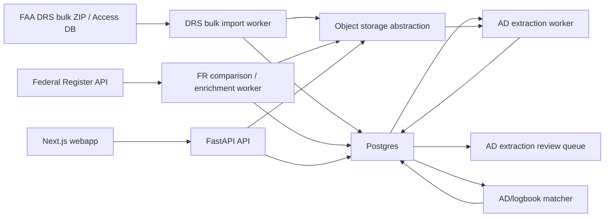

# paprnav AD Ingestion MVP Spec

Last updated: 2026-06-20

> Supersession note: D017 in `.ai/DECISIONS.md` changes the source ordering for the revised AD ingestion build. This file remains useful for the local Federal Register prototype and retention/review guidance, but its Federal Register-primary sections are superseded. The revised build should ingest the FAA DRS bulk ZIP/Access database first, then compare/enrich those ADs with Federal Register publications.

This spec replaces the legacy AWS-first AD ingestion draft for MVP implementation planning. It uses the legacy `ad-ingestion-spec.md` for domain context and `.ai/AD_INGESTION_REVIEW.md` for current architecture guidance.

The MVP architecture is local/service-first: FastAPI plus Python workers, Postgres for structured state, and an object storage abstraction for raw/source artifacts. AWS remains the likely production home, but AWS services should be introduced behind interfaces after the local MVP loop works.

## Goals

- Discover FAA Airworthiness Directive candidates by importing the DRS bulk ZIP/Access database, then compare/enrich them with Federal Register records when available.
- Classify FAA `Rule` documents from Federal Register delta/reconciliation flows so non-AD rules do not enter the AD corpus as authoritative ADs.
- Persist source metadata, raw/source snapshots, extracted structured AD data, confidence, supersession, and review status.
- Retain AD data after ingestion for audit, deterministic matching, cache reuse, and future algorithm replay.
- Provide structured AD records for aircraft/component applicability matching against logbook entries.
- Route low-confidence extraction and uncertain matching to human review.
- Keep the product framed as decision support, not official compliance attestation.

## Non-Goals For MVP

- No AWS IaC or cloud resources are required by this spec.
- No DynamoDB requirement for structured AD data.
- No OpenSearch Serverless requirement for search.
- No EventBridge, Lambda, or SQS requirement for the first local worker.
- No S3 Object Lock requirement for MVP.
- No emergency AD fast path until the normal ingestion/matching loop works.
- No foreign authority ingestion such as EASA or TCCA.
- No official regulatory compliance attestation.

## Source Ordering

Revised decision D017: use FAA DRS bulk ZIP/Access database ingestion as the primary AD corpus and applicability path, then compare/enrich discovered ADs with Federal Register records.

The existing Federal Register API prototype remains useful for publication matching, XML/body enrichment, corrections/supersession, and delta monitoring:

```text
https://www.federalregister.gov/api/v1/documents.json?conditions[agencies][]=federal-aviation-administration&conditions[type][]=RULE&order=newest
```

Important constraint:

- FAA `Rule` documents include ADs and non-AD rules. The ingester must classify/filter for Airworthiness Directives instead of trusting agency/type filters alone.

FAA DRS requirements:

- DRS bulk ZIP retrieval and Access database parsing are the default source path.
- DRS bulk fixtures should include the ZIP/database hash, table/column inventory, parser version, and sampled normalized rows.
- Live DRS Web UI scraping is not the default ingestion path. It may be used only for validation/diagnostics unless a later decision accepts it as a fallback.
- Any Web UI automation must be resumable, idempotent, rate-limited, manually gated, and disabled in CI.
- Pre-1994 ADs present in the DRS bulk data should be ingested. Complete pre-1994 historical coverage must remain unclaimed; the 2026-06-21 T071 validation result is conditional because rendered DRS Web UI snapshots and independent historical/index sources remain incomplete.

## MVP Architecture



Local development:

- Poller and extraction worker can be Python scripts or worker entrypoints.
- Object storage can be local filesystem paths under a configured data directory.
- Job state can live in Postgres tables.

AWS production later:

- Object storage abstraction can use S3.
- Worker triggers can move to EventBridge/SQS/Lambda or ECS.
- Secrets can move to SSM/Secrets Manager.
- Observability can move to CloudWatch.

The database model and API behavior should not depend on which orchestration layer runs the job.

## Discovery Flow

1. Worker loads the last successful discovery watermark.
2. Worker queries Federal Register FAA `Rule` documents, newest first or by publication date.
3. Worker paginates until it reaches already-seen documents.
4. For each document, worker stores a discovery record with:
   - Federal Register document number
   - title
   - abstract or excerpt when available
   - publication date
   - effective date when available
   - document type
   - agency metadata
   - HTML URL
   - PDF URL when present
   - raw API response snapshot or object reference
   - initial candidate classification
5. Worker updates the watermark only after records are safely persisted.

Discovery records should be idempotent by Federal Register document number.

## AD Classification

Classification decides whether an FAA `Rule` document is an AD candidate.

Minimum MVP classifier:

- Candidate if title or body strongly indicates "Airworthiness Directives" or an AD number pattern.
- Reject or mark non-AD if the document is clearly an unrelated FAA rule.
- Mark uncertain documents for review rather than treating them as authoritative ADs.

Recommended stored fields:

- `classification`: ad_candidate, non_ad_rule, uncertain
- `classification_confidence`
- `classification_reason`
- `classified_at`
- `classifier_name`
- `classifier_version`

Rejected non-AD records can be retained as lightweight discovery logs for reproducibility and classifier tuning. They do not need raw PDF retention unless useful for debugging.

## Source Artifact Retention

Retain AD data after ingestion.

Structured AD data should remain in Postgres indefinitely unless a formal retention policy says otherwise. Source metadata and normalized text snapshots should also be retained. Bulky PDFs/HTML/source artifacts should be stored in object storage with content-hash de-duplication and future lifecycle policies.

Reasons:

- AD matching must be reproducible.
- Supersession requires historical relationships.
- Corrections and HITL decisions need citations.
- Cached extraction avoids repeated provider/API cost.
- Future rule/model improvements need replay data.

Recommended object keys:

```text
ad-sources/
  federal-register/
    {document_number}/
      metadata.json
      source.html
      source.pdf
      normalized.txt
      extraction-input.json
```

Recommended hashes:

- `metadata_sha256`
- `html_sha256`
- `pdf_sha256`
- `normalized_text_sha256`
- `content_hash` for extraction cache and idempotency

## Postgres Persistence Model

Exact table names can change during implementation, but the model should include these concepts.

### ADDiscoveryRecord

Stores Federal Register discovery metadata and classification.

Key fields:

- `id`
- `federal_register_document_number`
- `title`
- `publication_date`
- `effective_date`
- `html_url`
- `pdf_url`
- `api_snapshot_storage_key`
- `classification`
- `classification_confidence`
- `classification_reason`
- `content_hash`
- `created_at`
- `updated_at`

### ADSourceArtifact

Stores source artifact references and hashes.

Key fields:

- `id`
- `ad_discovery_record_id`
- `artifact_type`: api_snapshot, html, pdf, normalized_text
- `storage_backend`: local, s3
- `storage_key`
- `sha256`
- `content_type`
- `created_at`

### AirworthinessDirective

Stores normalized AD identity and lifecycle state.

Key fields:

- `id`
- `ad_number`
- `federal_register_document_number`
- `title`
- `publication_date`
- `effective_date`
- `status`: effective, superseded, withdrawn, correction, unknown
- `source_record_id`
- `current_extraction_id`
- `review_status`: pending_extraction, needs_review, approved, rejected
- `created_at`
- `updated_at`

### ADExtraction

Stores structured extraction output and provider metadata.

Key fields:

- `id`
- `airworthiness_directive_id`
- `provider_name`
- `provider_version`
- `prompt_or_ruleset_hash`
- `input_content_hash`
- `schema_version`
- `extraction_json`
- `confidence`
- `status`: pending, complete, needs_review, approved, rejected, failed
- `error_message`
- `created_at`
- `updated_at`

Structured extraction should capture:

- affected aircraft makes/models
- serial number ranges
- affected engines, propellers, appliances, or equipment conditions
- compliance actions
- compliance intervals or due criteria
- effective date
- terminating actions
- supersedes/superseded-by clues
- citations back to source text sections

### ADApplicability

Stores queryable applicability rows derived from the extraction.

Key fields:

- `id`
- `airworthiness_directive_id`
- `target_type`: aircraft, engine, propeller, appliance, equipment_condition
- `make`
- `model`
- `serial_range_start`
- `serial_range_end`
- `condition_text`
- `confidence`
- `source_citation`
- `created_at`

### ADComplianceRequirement

Stores queryable compliance requirements.

Key fields:

- `id`
- `airworthiness_directive_id`
- `requirement_type`: one_time, recurring, conditional, terminating_action
- `action_summary`
- `interval_text`
- `due_within_hours`
- `due_within_cycles`
- `due_by_date`
- `recurrence_interval`
- `source_citation`
- `confidence`
- `created_at`

### ADSupersession

Stores graph relationships between ADs.

Key fields:

- `id`
- `superseding_ad_id`
- `superseded_ad_id`
- `relationship_type`: supersedes, corrects, withdraws, references
- `source_citation`
- `confidence`
- `created_at`

Supersession is a graph. Do not flatten it into one status string without preserving the relationship evidence.

### ADExtractionReview

Stores human review decisions for low-confidence or uncertain extraction.

Key fields:

- `id`
- `ad_extraction_id`
- `reviewed_by_user_id`
- `decision`: accept, edit, reject, defer
- `review_notes`
- `edited_extraction_json`
- `created_at`

Accepted/edited review output becomes eligible for matching.

## Extraction Flow

1. Extraction worker selects AD candidate discovery records with source artifacts ready.
2. Worker builds normalized text from HTML/PDF as available.
3. Worker computes a content hash and checks whether extraction already exists for the same content/provider/schema.
4. Worker extracts structured applicability, requirements, dates, supersession clues, and citations.
5. Worker validates output against a schema before persisting.
6. Worker stores provider/version/ruleset/prompt/hash metadata.
7. Worker routes low-confidence or schema-incomplete output to review.
8. Approved extraction populates queryable applicability and compliance requirement rows.

D015 selects a hybrid deterministic and LLM-assisted extraction strategy. The model must support deterministic parsing, LLM extraction, and schema-validated review routing behind provider metadata.

## Review Rules

Route extraction to review when:

- classification is uncertain
- extraction confidence is below the configured threshold
- required fields are missing
- applicability is component-specific or conditional and cannot be normalized confidently
- supersession is detected but cannot be linked to an existing AD
- source artifacts disagree in a meaningful way

Reviewers should see:

- Federal Register title, dates, and links
- source text or PDF link
- proposed structured extraction
- confidence and reason flags
- editable fields
- accept/edit/reject/defer actions

Review decisions must be audited with reviewer, timestamp, decision, and notes.

## AD-To-Logbook Matching Boundary

Matching is core MVP behavior, but detailed rules are T051/T052.

This ingestion spec must provide:

- approved structured AD records
- aircraft/component applicability fields
- compliance requirements
- supersession graph
- source citations
- confidence and review status

The matcher should bias toward unresolved/needs-review rather than false compliance.

## Future AWS Mapping

These services are optional production implementations, not MVP requirements:

- S3 can implement the object storage abstraction.
- EventBridge can schedule discovery.
- SQS can queue discovery/extraction jobs and provide DLQs.
- Lambda or ECS can run poller and extractor workers.
- DynamoDB can be reconsidered for specialized high-scale indexes, but Postgres is the MVP source of structured truth.
- OpenSearch can be added for lexical/vector search after structured Postgres queries are insufficient.
- Bedrock can be one extraction provider, behind provider metadata and schema validation.

Do not introduce AWS resources until infrastructure is explicitly modeled and reviewable.

## Open Questions

- How far back should historical AD backfill go for the first demo and MVP?
- What confidence threshold sends AD extraction to review?
- Should normalized AD text snapshots be stored indefinitely even if raw PDFs move to colder storage?
- Which concrete LLM provider/model should implement the LLM-assisted portion first?
- How should corrections published by the Federal Register be linked to parent AD records?
- What source citation granularity is enough for a useful reviewer workflow?
