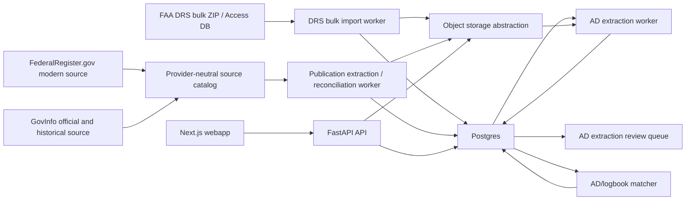

# paprnav AD Ingestion MVP Spec

Last updated: 2026-08-02

> Current decision chain: D017 keeps DRS bulk first for applicability indexing;
> D025 requires exhaustive Federal Register/GovInfo ingestion and
> reconciliation before any source coverage can be described as complete.

This spec replaces the legacy AWS-first AD ingestion draft for MVP implementation planning. It uses the legacy `ad-ingestion-spec.md` for domain context and `.ai/AD_INGESTION_REVIEW.md` for current architecture guidance.

The MVP architecture is local/service-first: FastAPI plus Python workers, Postgres for structured state, and an object storage abstraction for raw/source artifacts. AWS remains the likely production home, but AWS services should be introduced behind interfaces after the local MVP loop works.

## Goals

- Discover FAA Airworthiness Directive candidates from both the DRS bulk
  ZIP/Access database and the complete available Federal Register publication
  family, then reconcile their union and differences.
- Classify FAA `Rule` documents from Federal Register delta/reconciliation flows so non-AD rules do not enter the AD corpus as authoritative ADs.
- Persist source metadata, raw/source snapshots, extracted structured AD data, confidence, supersession, and review status.
- Retain AD data after ingestion for audit, deterministic matching, cache reuse, and future algorithm replay.
- Provide structured AD records for aircraft/component applicability matching against logbook entries.
- Route low-confidence extraction and uncertain matching to human review.
- Keep the product framed as decision support, not official compliance attestation.

## Non-Goals For MVP

- No AWS IaC or cloud resources are required by this spec.
- No DynamoDB requirement for structured AD data.
- No OpenSearch Serverless requirement for search.
- No EventBridge, Lambda, or SQS requirement for the first local worker.
- No S3 Object Lock requirement for MVP.
- No emergency AD fast path until the normal ingestion/matching loop works.
- No foreign authority ingestion such as EASA or TCCA.
- No official regulatory compliance attestation.

## Source Ordering

Revised decisions D017/D025: use FAA DRS bulk ZIP/Access ingestion first for
applicability indexing, but require Federal Register/GovInfo collection as an
independent publication catalog. Neither source may silently replace the other
or independently establish completeness.

The existing Federal Register API prototype remains useful for publication matching, XML/body enrichment, corrections/supersession, and delta monitoring:

```text
https://www.federalregister.gov/api/v1/documents.json?conditions[agencies][]=federal-aviation-administration&conditions[type][]=RULE&order=newest
```

Important constraint:

- FAA `Rule` documents include ADs and non-AD rules. The ingester must classify/filter for Airworthiness Directives instead of trusting agency/type filters alone.
- Discovery must retain every FAA rule in the requested enumeration before
  classification. A title prefix is a useful classification signal, not a
  completeness filter.

Federal Register publication routing:

- FederalRegister.gov provides structured JSON plus linked XML/HTML/PDF for
  modern discovery and requires no API key.
- GovInfo is the official artifact/archive path. Volumes 60 (1995) and later
  provide issue/document renditions; Volume 59 (1994) and earlier use the
  historical full-issue path.
- Direct predictable GovInfo content URLs are distinct from the GovInfo API;
  API enumeration requires an `api.data.gov` key.
- A provider-neutral source-document record exists before AD-number parsing.
  One source document may yield zero, one, or several directive, correction,
  or supersession records.
- Retain raw JSON/XML/HTML/PDF content through the storage abstraction using a
  content-addressed key. Postgres retains source identifiers, dates, URLs,
  hashes, parser/provider versions, manifests, and storage locations.
- Pagination follows `next_page_url` or the provider cursor until the declared
  result set is exhausted. Watermarks advance only after every source record
  and artifact is durably recorded.
- Standard tests use retained fixtures. Explicit live integration tests are
  manually gated, rate-limited, retryable, and excluded from ordinary CI.

Historical PDF routing:

1. Retain, inspect, and fingerprint the original issue.
2. Account for every page in a page-routing manifest.
3. Use native text only when reliability gates pass.
4. Canonically render unreliable pages and use Textract text detection.
5. Escalate column/heading/boundary uncertainty to Textract Layout.
6. Normalize provider output into page/line/word spans with geometry.
7. Apply versioned era-aware AD boundary and field patterns.
8. Send uncertain boundaries or structured fields to evidence-backed review.

OCR accuracy does not establish completeness. Completeness requires exhaustive
source/page manifests and DRS-versus-Federal-Register set reconciliation.

FAA DRS requirements:

- DRS bulk ZIP retrieval and Access database parsing are the default source path.
- DRS bulk fixtures should include the ZIP/database hash, table/column inventory, parser version, and sampled normalized rows.
- Live DRS Web UI scraping is not the default ingestion path. It may be used only for validation/diagnostics unless a later decision accepts it as a fallback.
- Any Web UI automation must be resumable, idempotent, rate-limited, manually gated, and disabled in CI.
- Pre-1994 ADs present in the DRS bulk data should be ingested. Complete pre-1994 historical coverage must remain unclaimed; the 2026-06-21 T071 validation result is conditional because rendered DRS Web UI snapshots and independent historical/index sources remain incomplete.

Current DRS bulk importer state as of 2026-06-27:

- `backend/app/services/drs_bulk_import.py` can import normalized row fixtures directly into DRS source snapshots, directives, publications, targets, and target applicability rows.
- ZIP import now attempts real Access table export through local `mdbtools` commands (`mdb-tables` and `mdb-export`) when those tools are installed.
- When Access export succeeds, the importer stores table names, row counts, columns, parser metadata, content hash, and row count on a single retained DRS source snapshot before importing parseable AD rows.
- When Access export is unavailable or yields no parseable rows, the importer explicitly marks the source snapshot as degraded (`partial`, or `failed` if no AD numbers can be recovered), records source-snapshot reconciliation issues, and only then falls back to the older binary AD-number scan.
- The binary scan fallback preserves AD-number provenance and source hash continuity, but it does not provide applicability rows. It opens per-directive `drs_zip_applicability_unparsed` issues so maintainers can repair parser/tooling coverage instead of mistaking the corpus for complete applicability evidence.
- Local CI/tests do not require `mdbtools`; the Access-export path is covered with monkeypatched command output and the degraded fallback is covered without native dependencies.

## MVP Architecture


```mermaid
flowchart LR
  DRS["FAA DRS bulk ZIP / Access DB"] --> Importer["DRS bulk import worker"]
  Importer --> DB["Postgres"]
  Importer --> Obj["Object storage abstraction"]
  FR["FederalRegister.gov modern source"] --> Catalog["Provider-neutral source catalog"]
  GI["GovInfo official and historical source"] --> Catalog
  Catalog --> Enrich["Publication extraction / reconciliation worker"]
  Enrich --> DB
  Enrich --> Obj
  DB --> Extract["AD extraction worker"]
  Obj --> Extract
  Extract --> DB
  DB --> Review["AD extraction review queue"]
  DB --> Match["AD/logbook matcher"]
  Match --> DB
  Web["Next.js webapp"] --> API["FastAPI API"]
  API --> DB
  API --> Obj
```

Local development:

- Poller and extraction worker can be Python scripts or worker entrypoints.
- Object storage can be local filesystem paths under a configured data directory.
- Job state can live in Postgres tables.

AWS production later:

- Object storage abstraction can use S3.
- Worker triggers can move to EventBridge/SQS/Lambda or ECS.
- Secrets can move to SSM/Secrets Manager.
- Observability can move to CloudWatch.

The database model and API behavior should not depend on which orchestration layer runs the job.

## Modern Federal Register Discovery Flow

1. Worker loads the last successful discovery watermark.
2. Worker queries Federal Register FAA `Rule` documents, newest first or by publication date.
3. Worker paginates to the provider-declared end, even when some documents were
   seen previously; idempotency skips unchanged content without truncating the
   completeness manifest.
4. For each document, worker stores a discovery record with:
   - Federal Register document number
   - title
   - abstract or excerpt when available
   - publication date
   - effective date when available
   - document type
   - agency metadata
   - HTML URL
   - PDF URL when present
   - raw API response snapshot or object reference
   - initial candidate classification
5. Worker updates the watermark only after records are safely persisted.

Modern discovery records should be idempotent by source system plus Federal
Register document number and content hash. Historical GovInfo issues use
package/granule identifiers where available and content-derived identifiers
otherwise.

## AD Classification

Classification decides whether an FAA `Rule` document is an AD candidate.

Minimum MVP classifier:

- Candidate if title or body strongly indicates "Airworthiness Directives" or an AD number pattern.
- Reject or mark non-AD if the document is clearly an unrelated FAA rule.
- Mark uncertain documents for review rather than treating them as authoritative ADs.

Recommended stored fields:

- `classification`: ad_candidate, non_ad_rule, uncertain
- `classification_confidence`
- `classification_reason`
- `classified_at`
- `classifier_name`
- `classifier_version`

Rejected non-AD records can be retained as lightweight discovery logs for reproducibility and classifier tuning. They do not need raw PDF retention unless useful for debugging.

## Source Artifact Retention

Retain AD data after ingestion.

Structured AD data should remain in Postgres indefinitely unless a formal retention policy says otherwise. Source metadata and normalized text snapshots should also be retained. Bulky PDFs/HTML/source artifacts should be stored in object storage with content-hash de-duplication and future lifecycle policies.

Reasons:

- AD matching must be reproducible.
- Supersession requires historical relationships.
- Corrections and HITL decisions need citations.
- Cached extraction avoids repeated provider/API cost.
- Future rule/model improvements need replay data.

Recommended object keys:

```text
ad-sources/
  federal-register/
    {document_number}/
      metadata.json
      source.html
      source.pdf
      normalized.txt
      extraction-input.json
```

Recommended hashes:

- `metadata_sha256`
- `html_sha256`
- `pdf_sha256`
- `normalized_text_sha256`
- `content_hash` for extraction cache and idempotency

## Postgres Persistence Model

Exact table names can change during implementation, but the model should include these concepts.

### ADDiscoveryRecord

Stores Federal Register discovery metadata and classification.

Key fields:

- `id`
- `federal_register_document_number`
- `title`
- `publication_date`
- `effective_date`
- `html_url`
- `pdf_url`
- `api_snapshot_storage_key`
- `classification`
- `classification_confidence`
- `classification_reason`
- `content_hash`
- `created_at`
- `updated_at`

### ADSourceArtifact

Stores source artifact references and hashes.

Key fields:

- `id`
- `ad_discovery_record_id`
- `artifact_type`: api_snapshot, html, pdf, normalized_text
- `storage_backend`: local, s3
- `storage_key`
- `sha256`
- `content_type`
- `created_at`

### AirworthinessDirective

Stores normalized AD identity and lifecycle state.

Key fields:

- `id`
- `ad_number`
- `federal_register_document_number`
- `title`
- `publication_date`
- `effective_date`
- `status`: effective, superseded, withdrawn, correction, unknown
- `source_record_id`
- `current_extraction_id`
- `review_status`: pending_extraction, needs_review, approved, rejected
- `created_at`
- `updated_at`

### ADExtraction

Stores structured extraction output and provider metadata.

Key fields:

- `id`
- `airworthiness_directive_id`
- `provider_name`
- `provider_version`
- `prompt_or_ruleset_hash`
- `input_content_hash`
- `schema_version`
- `extraction_json`
- `confidence`
- `status`: pending, complete, needs_review, approved, rejected, failed
- `error_message`
- `created_at`
- `updated_at`

Structured extraction should capture:

- affected aircraft makes/models
- serial number ranges
- affected engines, propellers, appliances, or equipment conditions
- compliance actions
- compliance intervals or due criteria
- effective date
- terminating actions
- supersedes/superseded-by clues
- citations back to source text sections

### ADApplicability

Stores queryable applicability rows derived from the extraction.

Key fields:

- `id`
- `airworthiness_directive_id`
- `target_type`: aircraft, engine, propeller, appliance, equipment_condition
- `make`
- `model`
- `serial_range_start`
- `serial_range_end`
- `condition_text`
- `confidence`
- `source_citation`
- `created_at`

### ADComplianceRequirement

Stores queryable compliance requirements.

Key fields:

- `id`
- `airworthiness_directive_id`
- `requirement_type`: one_time, recurring, conditional, terminating_action
- `action_summary`
- `interval_text`
- `due_within_hours`
- `due_within_cycles`
- `due_by_date`
- `recurrence_interval`
- `source_citation`
- `confidence`
- `created_at`

### ADSupersession

Stores graph relationships between ADs.

Key fields:

- `id`
- `superseding_ad_id`
- `superseded_ad_id`
- `relationship_type`: supersedes, corrects, withdraws, references
- `source_citation`
- `confidence`
- `created_at`

Supersession is a graph. Do not flatten it into one status string without preserving the relationship evidence.

### ADExtractionReview

Stores human review decisions for low-confidence or uncertain extraction.

Key fields:

- `id`
- `ad_extraction_id`
- `reviewed_by_user_id`
- `decision`: accept, edit, reject, defer
- `review_notes`
- `edited_extraction_json`
- `created_at`

Accepted/edited review output becomes eligible for matching.

## Extraction Flow

1. Extraction worker selects AD candidate discovery records with source artifacts ready.
2. Worker builds normalized text from HTML/PDF as available.
3. Worker computes a content hash and checks whether extraction already exists for the same content/provider/schema.
4. Worker extracts structured applicability, requirements, dates, supersession clues, and citations.
5. Worker validates output against a schema before persisting.
6. Worker stores provider/version/ruleset/prompt/hash metadata.
7. Worker routes low-confidence or schema-incomplete output to review.
8. Approved extraction populates queryable applicability and compliance requirement rows.

D015 selects a hybrid deterministic and LLM-assisted extraction strategy. The model must support deterministic parsing, LLM extraction, and schema-validated review routing behind provider metadata.

## Review Rules

Route extraction to review when:

- classification is uncertain
- extraction confidence is below the configured threshold
- required fields are missing
- applicability is component-specific or conditional and cannot be normalized confidently
- supersession is detected but cannot be linked to an existing AD
- source artifacts disagree in a meaningful way

Reviewers should see:

- Federal Register title, dates, and links
- source text or PDF link
- proposed structured extraction
- confidence and reason flags
- editable fields
- accept/edit/reject/defer actions

Review decisions must be audited with reviewer, timestamp, decision, and notes.

## AD-To-Logbook Matching Boundary

Matching is core MVP behavior, but detailed rules are T051/T052.

This ingestion spec must provide:

- approved structured AD records
- aircraft/component applicability fields
- compliance requirements
- supersession graph
- source citations
- confidence and review status

The matcher should bias toward unresolved/needs-review rather than false compliance.

## Future AWS Mapping

These services are optional production implementations, not MVP requirements:

- S3 can implement the object storage abstraction.
- EventBridge can schedule discovery.
- SQS can queue discovery/extraction jobs and provide DLQs.
- Lambda or ECS can run poller and extractor workers.
- DynamoDB can be reconsidered for specialized high-scale indexes, but Postgres is the MVP source of structured truth.
- OpenSearch can be added for lexical/vector search after structured Postgres queries are insufficient.
- Bedrock can be one extraction provider, behind provider metadata and schema validation.

Do not introduce AWS resources until infrastructure is explicitly modeled and reviewable.

## Open Questions

- How should staged historical backfill be scheduled while keeping coverage
  explicitly degraded until the complete available target history is proven?
- What confidence threshold sends AD extraction to review?
- Should normalized AD text snapshots be stored indefinitely even if raw PDFs move to colder storage?
- Which concrete LLM provider/model should implement the LLM-assisted portion first?
- How should corrections published by the Federal Register be linked to parent AD records?
- What source citation granularity is enough for a useful reviewer workflow?
