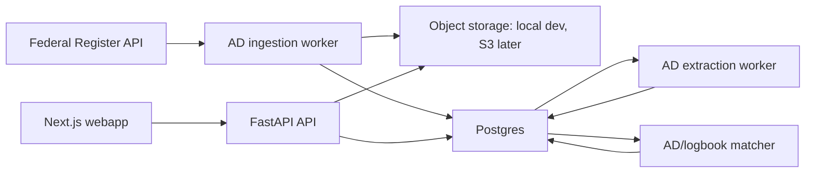

# AD Ingestion Spec Review

Last updated: 2026-06-16

Reviewed source: `ad-ingestion-spec.md`

## Summary

The legacy AD ingestion spec has strong domain instincts: use Federal Register as the primary source, preserve raw source artifacts, extract structured applicability and compliance timing, track supersession, and route low-confidence results to human review.

The main conflicts are scope and architecture. The current paprnav repo is a FastAPI/Postgres/Next app with no AWS IaC. The legacy spec jumps directly to EventBridge, Lambda, SQS, S3 Object Lock, DynamoDB, OpenSearch Serverless, and Bedrock. That may be a good future production architecture, but it is too much for the MVP and conflicts with the repo's existing Postgres direction.

## Keep

- Federal Register API as the primary discovery source.
- FAA DRS as reconciliation/backfill only, not primary ingestion.
- Raw/source artifact retention for audit and reprocessing.
- Content hashing to avoid duplicate extraction work.
- Applicability extraction with confidence scores.
- Supersession modeled explicitly.
- Low-confidence extraction routed to human review.
- "Decision support, not compliance attestation" framing.
- Bias toward false positives/unresolved review instead of false compliance.

## Rewrite

- Replace the AWS-first MVP with a local/service-first architecture:
  - FastAPI worker or separate Python service for polling/extraction.
  - Postgres for structured AD records, extraction results, review states, and matching/adjudication.
  - Object storage abstraction for raw PDFs/HTML/snapshots; local filesystem in dev, S3 later.
  - Queue abstraction can start in Postgres job tables or a lightweight worker queue, then move to SQS if scale requires.
- Filter Federal Register results more tightly:
  - FAA `Rule` documents include many non-AD rules.
  - Add title/abstract/body classifier for Airworthiness Directives.
  - Store rejected FAA rules only as lightweight discovery logs if needed.
- Make AD matching part of MVP scope:
  - The legacy spec puts comparison against maintenance books out of scope.
  - For paprnav MVP, AD-to-logbook matching and HITL adjudication are core product behavior.
- Keep OpenSearch optional:
  - Defer until lexical/vector search is needed.
  - Structured Postgres queries plus focused text search are enough for the first matching loop.
- Treat Bedrock/LLM extraction as an interchangeable extraction provider:
  - Useful, but not required as a hard dependency for local MVP.
  - Persist provider/version/prompt/hash metadata for audit and reprocessing.

## Remove Or Defer

- Do not require DynamoDB for MVP structured AD data.
- Do not require OpenSearch Serverless for MVP.
- Do not require S3 Object Lock Compliance mode for MVP.
- Do not require EventBridge/Lambda/SQS before the app has a working local ingestion path.
- Do not build emergency AD fast path before the core ingestion/matching loop works.
- Do not claim Federal Register FAA `Rule` results are all ADs.

## Storage Recommendation

Keep AD data after ingestion.

Reasons:

- AD matching must be reproducible.
- Supersession requires historical relationships.
- Corrections and HITL decisions need source citations.
- Cached extraction avoids repeated OCR/LLM/API costs.
- Future algorithm improvements need replay data.

Storage optimization:

- Store structured AD data indefinitely in Postgres.
- Store source metadata and normalized text snapshots indefinitely.
- Store bulky raw PDFs/HTML in object storage with content-hash de-duplication.
- Use lifecycle policies later for old bulky artifacts, but keep enough source material to prove what the system saw.
- Re-fetching official PDFs later should be a fallback, not the primary audit strategy.

## Suggested MVP Architecture



## Verified API Note

A live Federal Register API request on 2026-06-16 returned FAA `Rule` documents with AD records mixed with non-AD FAA rules. The ingester must classify/filter for ADs instead of relying only on `conditions[agencies][]=federal-aviation-administration` and `conditions[type][]=RULE`.

Example official API endpoint pattern:

```text
https://www.federalregister.gov/api/v1/documents.json?conditions[agencies][]=federal-aviation-administration&conditions[type][]=RULE&order=newest
```

## Recommended Spec Status

Do not delete `ad-ingestion-spec.md`; mark it as a legacy AWS production architecture concept and point readers to this review plus `.ai/MVP_COMPLETION.md`.

